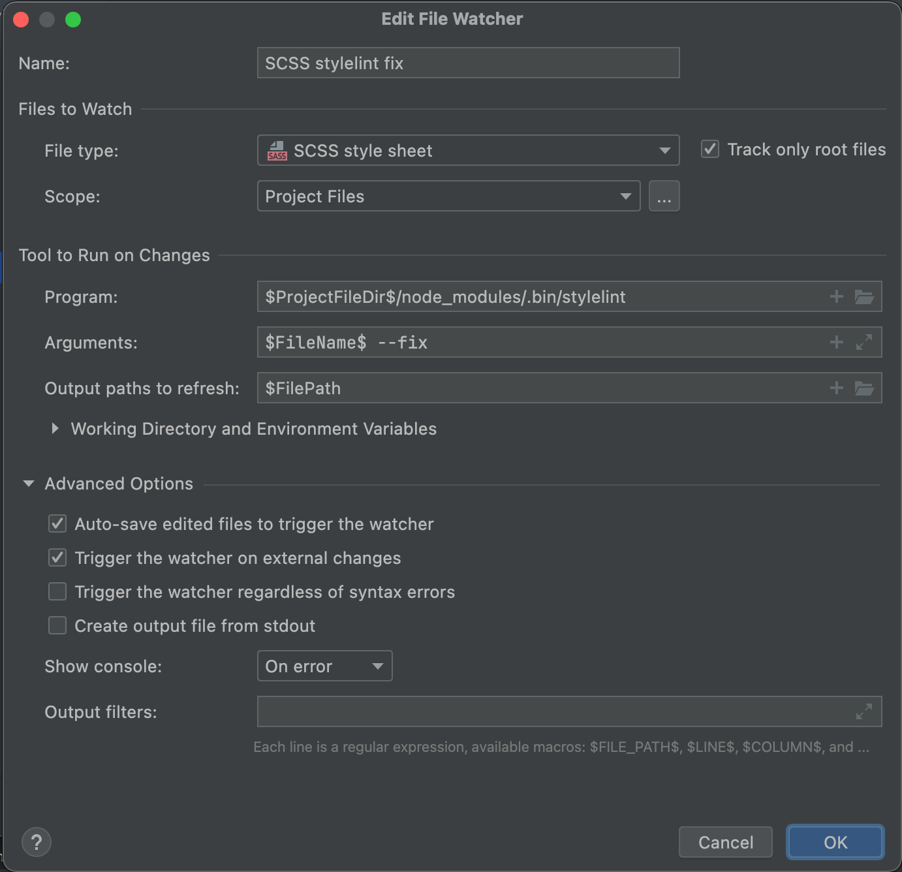

# Дефолтный шаблон для разработки

## Содержание <a name = "content_table"></a>

- [О шаблоне](#about)
- [Начало работы](#getting-started)
- [Настройка окружения](#getting-started)
  - [Настройка JS-линтера (ESLint и Prettier)](#linter_js)
  - [Настройка CSS-линтера (Stylelint)](#linter_scss)
- [Скрипты](#scripts)

## О шаблоне <a name = "about"></a>

Шаблон создан с помощью [Create React App](https://github.com/facebook/create-react-app).

В шаблоне используются:
- [React](https://reactjs.org/),
- [Redux](https://redux.js.org/), 
- [Typescript](https://www.typescriptlang.org/), 
- [SCSS](https://sass-lang.com/), 
- [ES Lint](https://eslint.org/), 
- [Prettier](https://prettier.io/), 
- [Stylelint](https://stylelint.io/)

Вернуться [К содержанию](#content_table)

## Начало разработки <a name = "getting-started"></a>

1. Установить зависимости:
```bash
npm сi
```

Вернуться [К содержанию](#content_table)

## Настройка окружения

На проекте используются JS и CSS линтеры. Их настройка на примере **PHPStorm**.

### Настройка JS-линтера (ESLint и Prettier) <a name = "linter_js"></a>

#### ES Lint:

- `Preferences | Languages & Frameworks | JavaScript | Code Quality Tools | ESLint`
- Указать путь к npm-модулю: `YOUR_PATH_TO_PROJECT/node_modules/eslint`
- Указать путь к файлу с конфигом: `YOUR_PATH_TO_PROJECT/.eslintrc`

#### Prettier

- Установить [плагин Prettier](https://plugins.jetbrains.com/plugin/10456-prettier).
- Настроить автоформатирования кода при сохранении ([подробнее](https://prettier.io/docs/en/webstorm.html)).
    - `Preferences | Languages & Frameworks | JavaScript | Prettier`
    - Указать путь к npm-модулю: `YOUR_PATH_TO_PROJECT/node_modules/prettier`
    - Поставить галочку `Run on save for file`

Теперь при каждом сохранении файла ES Lint будет подчеркивать ошибки, а Prettier  автоформатировать код.

Кроме того, проверку можно запустить вручную, запустив скрипт:
```bash
npm run lint-js
```

Вернуться [К содержанию](#content_table)

## Настройка CSS-линтера (Stylelint) <a name = "linter_scss"></a>

**Для phpStorm**
- Включить опцию `Languages & Frameworks - Style Sheets - Stylelint`
- Указать путь к npm-пакету
- Указать путь к файлу конфига

Теперь IDE начнет подчеркивать красным ошибки в scss-коде.

Дополнительно можно настроить watcher в своей IDE, который при изменении будет автоматически править ошибки (autofix поддерживается не для всех правил). Для PhpStorm: `Tools - File Watchers - Add(+)`.

Для MacOS:




Кроме того, проверку можно запустить вручную, запустив один из скриптов:
```bash
npm run lint-styles
npm run lint-styles-fix
```

Вернуться [К содержанию](#content_table)

## Скрипты <a name = "scripts"></a>

In the project directory, you can run:

### `npm start`

Runs the app in the development mode.\
Open [http://localhost:3000](http://localhost:3000) to view it in the browser.

The page will reload if you make edits.\
You will also see any lint errors in the console.

### `npm test`

Launches the test runner in the interactive watch mode.\
See the section about [running tests](https://facebook.github.io/create-react-app/docs/running-tests) for more information.

### `npm run build`

Builds the app for production to the `build` folder.\
It correctly bundles React in production mode and optimizes the build for the best performance.

The build is minified and the filenames include the hashes.\
Your app is ready to be deployed!

See the section about [deployment](https://facebook.github.io/create-react-app/docs/deployment) for more information.

### `npm run eject`

**Note: this is a one-way operation. Once you `eject`, you can’t go back!**

If you aren’t satisfied with the build tool and configuration choices, you can `eject` at any time. This command will remove the single build dependency from your project.

Instead, it will copy all the configuration files and the transitive dependencies (webpack, Babel, ESLint, etc) right into your project so you have full control over them. All of the commands except `eject` will still work, but they will point to the copied scripts so you can tweak them. At this point you’re on your own.

You don’t have to ever use `eject`. The curated feature set is suitable for small and middle deployments, and you shouldn’t feel obligated to use this feature. However we understand that this tool wouldn’t be useful if you couldn’t customize it when you are ready for it.

Вернуться [К содержанию](#content_table)
